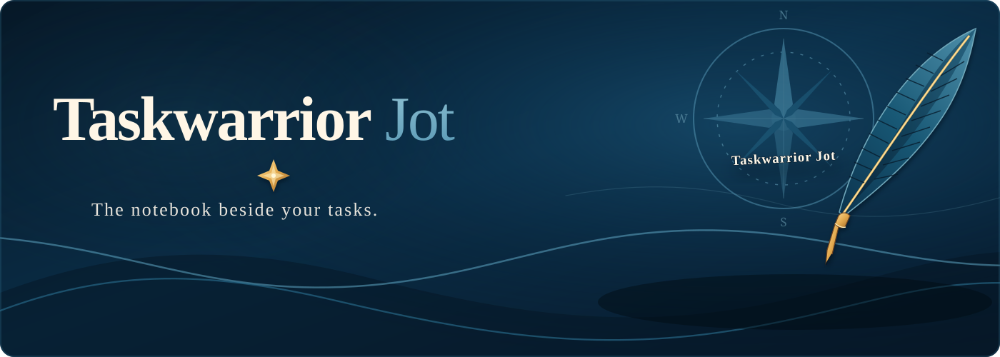

Jot is a note-first companion for [Taskwarrior](https://taskwarrior.org/) and
[Taskwarrior-Nautical](https://github.com/catanadj/taskwarrior-nautical). It keeps the context
around your work close to the task: decisions, progress, links, files, and
time spent.

Taskwarrior tells you what needs doing. Jot helps you remember how the work is
going.

## Install

For a direct install of the latest tagged release:

```bash
curl -fsSL https://raw.githubusercontent.com/catanadj/taskwarrior-jot/main/bootstrap.sh | bash
```


The installer places `jot` in `~/.local/bin` and stores notes below the active
Taskwarrior data directory. It respects `TASKDATA`, `TASKRC`, and Taskwarrior
configuration.

Python 3.11 or newer is required. The optional TUI requires `textual`.

## Start Using It

Open the note for a task:

```bash
jot 42
```

Add a quick entry without opening an editor:

```bash
jot note-append 42 "Vendor confirmed the invoice was regenerated"
```

Add a next step under a heading:

```bash
jot add-to task 42 --heading "Next steps" --text "Call the vendor Monday"
```

Browse everything interactively:

```bash
jot tui
```

## What Jot Covers

- Task, chain, and project notes
- Search, recent edits, links, and attached resources
- Content-agnostic progress tracking
- Time expenditure logs and reports
- Timewarrior tag routing
- Templates and timestamp expansion
- A terminal user interface for browsing and editing
- JSON output for scripts and integrations

Read the [documentation](documentation/README.md) for practical workflows,
configuration, and the complete command reference.

## Nautical Companion

Jot complements Nautical rather than replacing it. Nautical manages recurring
task behavior; Jot keeps durable notes for the task, its chain, and its
project. See [Nautical integration](documentation/nautical.md).

If Jot is useful to you, support is appreciated:

[Buy me a book](https://buymeacoffee.com/catanadj)
